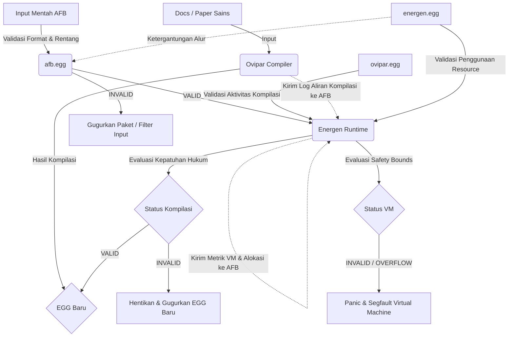

# Desain Metacompiler: `ovipar.egg` & `energen.egg`

Dokumen ini menjelaskan desain arsitektur pengaman mandiri (*self-bootstrapping guard*) untuk sistem Sci-FI (Sci-FI). Dengan memodelkan perilaku compiler (**Ovipar**) dan runtime (**Energen**) sebagai dimensi fisis di dalam berkas `.egg`, kita dapat menjamin keamanan kompilasi dan eksekusi secara deterministik tanpa bergantung pada lapisan pengaman eksternal.

---

## 1. Alur Bootstrapping (Siklus Pengamanan Mandiri)

Proses kompilasi dan eksekusi berjalan di bawah kendali *self-referential validation loop*:



---

## 2. Desain `ovipar.egg` (Compiler Guard)

`ovipar.egg` bertugas memastikan bahwa **Ovipar** melakukan kompilasi dengan benar, tidak melanggar aturan teori graf, dan tidak membocorkan informasi sensitif ke dalam berkas biner `.egg` yang dihasilkan.

### Dimensi AFB (`ovipar.egg`)

| ID | Dimensi | Skala `[0, 1]` | Deskripsi Fisis / Formal |
| --- | --- | --- | --- |
| `0xD0` | **`0xINGEST_ENTROPY`** | `0.0` s/d `1.0` | Entropi bahasa dokumen input. `1.0` berarti teks sangat acak dan tidak terstruktur (raw parser failure). |
| `0xD1` | **`0xCAUSAL_CYCLE`** | `0.0` s/d `1.0` | Deteksi adanya siklus tertutup (circular dependency) pada Causal DAG. Kudu mutlak `0.0`. |
| `0xD2` | **`0xALIGN_DRIFT`** | `0.0` s/d `1.0` | Deviasi perataan memori dari batas 64-bit (memory boundary alignment). Kudu mutlak `0.0`. |
| `0xD3` | **`0xSECRET_EXPOSURE`** | `0.0` s/d `1.0` | Rasio adanya kata kunci sensitif (API key, token) yang bocor dari environment ke dalam metadata EGG. |
| `0xD4` | **`0xCOMPILER_VALIDITY`** | `0.0` (Error) s/d `1.0` (Valid) | Output Head: Hasil evaluasi kelayakan berkas `.egg` hasil kompilasi. |

### Kebijakan Membrane & Causal Mask (`ovipar.egg`)

```
0xINGEST_ENTROPY ─────┐
                      ├───→ 0xCOMPILER_VALIDITY
0xCAUSAL_CYCLE ───────┤
                      │
0xALIGN_DRIFT ────────┤
                      │
0xSECRET_EXPOSURE ────┘
```

* **Aturan Kaku (Shell Rules)**:
  * `0xCAUSAL_CYCLE` $\le 0.0$ (Adanya siklus = batalkan kompilasi).
  * `0xALIGN_DRIFT` $\le 0.0$ (Memori tidak selaras = tolak penulisan biner).
  * `0xSECRET_EXPOSURE` $\le 0.0$ (Ada kebocoran rahasia = karantina berkas).
  * **Verifikasi Tanda Tangan (Signature Verification)**: Semua berkas `.egg` wajib ditandatangani secara kriptografis menggunakan algoritma **Ed25519** oleh otoritas pengembang yang sah. Energen akan menolak memetakan (`mmap`) EGG yang tidak memiliki tanda tangan valid guna mencegah serangan injeksi model jahat (*devil laws*).
  * **Firewall Kausalitas (Causal Leakage Check)**: Analisis topologi DAG dilarang memiliki jalur kausalitas aktif dari dimensi privat/sensitif (misal `0xSECRET`) ke dimensi output publik. Jika terdeteksi, EGG dicap cacat dan dibatalkan.


---

## 3. Desain `energen.egg` (Runtime Sandbox Guard)

`energen.egg` bertugas memantau kinerja virtual machine **Energen** secara internal. Karena berkas ini sudah **tertanam langsung (*baked-in*)** ke dalam biner program Energen saat fase kompilasi compile-time (di-embed sebagai data static struct), ia **tidak membutuhkan Shell, Albumin, atau Signature**. Di dalam biner, `energen.egg` murni hanya terdiri dari segmentasi **Yolk (bobot attention)** dan **Membrane (causal mask)** untuk menghemat memori.

### Dimensi AFB (`energen.egg`)

| ID | Dimensi | Skala `[0, 1]` | Deskripsi Fisis / Formal |
| --- | --- | --- | --- |
| `0xE0` | **`0xVM_MEMORY`** | `0.0` s/d `1.0` | Penggunaan memori virtual machine terhadap batas alokasi aman (max heap limit). |
| `0xE1` | **`0xVM_CPU`** | `0.0` s/d `1.0` | Persentase siklus CPU yang dikonsumsi per state transition. |
| `0xE2` | **`0xSTACK_DEPTH`** | `0.0` s/d `1.0` | Kedalaman tumpukan pemanggilan fungsi (recursion level) dalam evaluasi graf. |
| `0xE3` | **`0xOUT_OF_BOUNDS`** | `0.0` (Aman) s/d `1.0` (Violated) | Percobaan menulis data ke luar rentang alamat memori yang dialokasikan. |
| `0xE4` | **`0xVM_PANIC`** | `0.0` (Running) s/d `1.0` (Halt) | Output Head: Sinyal pemutus arus untuk langsung mematikan virtual machine runtime. |

### Kebijakan Membrane & Causal Mask (`energen.egg`)

```
0xVM_MEMORY ──────────┐
0xSTACK_DEPTH ────────┼───→ 0xVM_PANIC
0xOUT_OF_BOUNDS ──────┘
```

* **Aturan Kaku (Shell Rules)**:
  * `0xOUT_OF_BOUNDS` $> 0.0 \rightarrow$ `0xVM_PANIC = 1.0` (Percobaan segfault langsung mematikan VM).
  * `0xSTACK_DEPTH` $> 0.90 \rightarrow$ `0xVM_PANIC = 1.0` (Mencegah stack overflow).
  * `0xVM_MEMORY` $> 0.95 \rightarrow$ `0xVM_PANIC = 1.0` (Mencegah out of memory).

---

## 3.4. Fungsi `egg-reader` (Native System Parser - Bukan Ranah Sci)

Proses **"makan EGG"** — yaitu mengunduh (*download*), mem-parse header biner, melakukan verifikasi tanda tangan kriptografis **Ed25519** dari `egg.hub`, dan mengalokasikan memori — sepenuhnya merupakan **ranah native system runtime (Energen / Agent)** yang ditulis di bahasa pemrograman **Zig**, bukan ranah Sci (neural attention).

### Pembagian Peran: `egg-reader` vs. `egg-digester.egg`

Proses memproses EGG baru dibagi menjadi dua lapis pertahanan yang terpisah berdasarkan domainnya:

1. **`egg-reader` (Native System - Zig)**:
   * **Peran**: Menangani operasi kotor I/O dan kriptografi biner yang bersifat diskrit/deterministik.
   * **Tugas**: Membaca file dari `egg.hub`, mem-parse offset header biner, dan memverifikasi tanda tangan kriptografi **Ed25519** secara native menggunakan library internal CPU.
2. **`egg-digester.egg` (Sci-LM - Baked-in)**:
   * **Peran**: Menangani **verifikasi semantik hukum sains** di dalam EGG baru menggunakan sirkuit attention.
   * **Tugas**: Mengecek apakah sirkuit attention EGG baru stabil, tidak melanggar batas alokasi dimensi robot, dan tidak memiliki siklus kausalitas (*causal loops*) yang merusak hukum fisika dasar.

---

## 3.4. Desain `egg-digester.egg` (Sci Ingestion Guard - Baked-in)

`egg-digester.egg` adalah sentinel sains yang memastikan hukum fisika yang dibawa oleh EGG baru aman dan konsisten dengan baseline physics robot. Berkas ini tertanam langsung (*baked-in*) di dalam biner Energen tanpa overhead Shell.

### Dimensi AFB (`egg-digester.egg`)

| ID | Dimensi | Skala `[0, 1]` | Deskripsi Fisis / Formal |
| --- | --- | --- | --- |
| `0xC0` | **`0xDIGEST_CAUSAL_VALIDITY`** | `0.0` (Violated) s/d `1.0` (Valid) | Verifikasi sirkuit attention EGG baru tidak memiliki loop kausalitas melingkar yang ilegal. |
| `0xC1` | **`0xSIGNATURE_ED25519`** | `0.0` (Untrusted) s/d `1.0` (Trusted) | Hasil verifikasi tanda tangan kriptografis Ed25519 dari berkas EGG yang di-ingest. |
| `0xC2` | **`0xDIGEST_LIMIT_EXCEEDED`** | `0.0` (Safe) s/d `1.0` (Limit Out) | Pengecekan apakah tuntutan dimensi/resource EGG melampaui sisa kapasitas alokasi robot. |
| `0xC4` | **`0xINGEST_MAGIC`** | `0.0` (Invalid) s/d `1.0` (Valid) | Hasil validasi identitas berkas sekaligus versi kontainer EGG (wajib `0xE661` untuk EGG v1). |
| `0xC3` | **`0xDIGEST_STATUS`** | `0.0` (Aborted) s/d `1.0` (Approved) | Output Head: Keputusan apakah hukum sains EGG baru aman untuk di-splice ke Energen. |

### Kebijakan Membrane & Causal Mask (`egg-digester.egg`)

```
0xDIGEST_CAUSAL_VALIDITY ──┐
0xSIGNATURE_ED25519 ───────┼───→ 0xDIGEST_STATUS
0xDIGEST_LIMIT_EXCEEDED ───┤
0xINGEST_MAGIC ────────────┘
```

* **Aturan Kaku (Shell Rules)**:
  * `0xDIGEST_CAUSAL_VALIDITY` $< 1.0 \rightarrow$ `0xDIGEST_STATUS = 0.0` (DAG rusak = tolak asimilasi).
  * `0xSIGNATURE_ED25519` $< 1.0 \rightarrow$ `0xDIGEST_STATUS = 0.0` (Tanda tangan salah/ilegal = tolak modul).
  * `0xDIGEST_LIMIT_EXCEEDED` $> 0.0 \rightarrow$ `0xDIGEST_STATUS = 0.0` (Melebihi batas hardware = gagalkan ingesti).
  * `0xINGEST_MAGIC` $< 1.0 \rightarrow$ `0xDIGEST_STATUS = 0.0` (Magic number/versi tidak cocok = tolak EGG).


---

## 3.5. Desain `afb.egg` (Input Stream Guard)

`afb.egg` adalah gerbang pertahanan pertama (*first line of defense*) yang memvalidasi integritas data mentah yang mengalir masuk ke dalam **Agent Frame Buffer (AFB)** dari dunia luar (sensor, AI model, network socket).

### Dimensi AFB (`afb.egg`)

| ID | Dimensi | Skala `[0, 1]` | Deskripsi Fisis / Formal |
| --- | --- | --- | --- |
| `0xF0` | **`0xINPUT_OUT_OF_RANGE`** | `0.0` s/d `1.0` | Deteksi apakah ada nilai koordinat AFB masuk yang berada di luar batas `[0, 1]`. |
| `0xF1` | **`0xINPUT_MUTATION_RATE`** | `0.0` s/d `1.0` | Kecepatan perubahan input fisis (derau/noise ekstrim). Mengidentifikasi anomali data. |
| `0xF2` | **`0xINPUT_FORMAT_VALID`** | `0.0` (Corrupt) s/d `1.0` (Clean) | Hasil parsing struktur paket biner ADN (validitas byte header dan checksum). |
| `0xF3` | **`0xINPUT_SAFETY_STATUS`** | `0.0` (Blocked) s/d `1.0` (Passed) | Output Head: Menentukan apakah paket AFB diizinkan diteruskan ke VM Energen. |
| `0xF4` | **`0xCURRENT_DIMENSIONS`** | `0.0` s/d `1.0` | Jumlah dimensi aktif unik yang dikirimkan dalam paket AFB saat ini. |
| `0xF5` | **`0xMAX_DIMENSIONS`** | `0.0` s/d `1.0` | Batas maksimum dimensi aktif ($N$) yang diizinkan oleh kebijakan sistem. |

---
### Anatomi & Formulasi `afb.egg`

#### 1. Shell (Hard Bounds)
Menolak paket secara instan jika parameter dasar protokol dilanggar sebelum masuk ke sirkuit attention:
*   **Format Validasi**: `0xINPUT_FORMAT_VALID` harus bernilai mutlak `1.0`. Jika magic header tidak sesuai dengan **`0xAFB1`**, atau panjang paket biner tidak cocok dengan rumus $4 + (N \times 8)$ bytes, nilai ini di-drop ke `0.0` dan memicu pemblokiran instan.
*   **Batas Ukuran**: `0xCURRENT_DIMENSIONS` $\le$ `0xMAX_DIMENSIONS`. Mencegah serangan *buffer overflow* / *denial of service* dengan mengirim ribuan token palsu.

#### 2. Albumin (Data Injection & Normalization)
Menerjemahkan status fisik dari data input yang ditarik dari *back-buffer* menjadi representasi vektor kontinu.
*   **Formulasi Divergensi Input (`0xINPUT_DIVERGENCE`)**:
    Evaluasi dilakukan pada payload untuk memastikan seluruh nilai ($v_i$) bebas dari kondisi NaN, tak-terhingga, atau luapan ekstrem (melebihi batas toleransi kasar $\pm 100.0$):
    $$\text{Val}(0xINPUT\_DIVERGENCE) = \max_{i=1}^{N} \left( \mathbb{I}(v_i = \text{NaN}) + \mathbb{I}(|v_i| = \infty) + \mathbb{I}(|v_i| > 100.0) \right)$$
    Jika ditemukan satu saja dimensi dengan nilai divergen atau luapan ekstrem, dimensi ini bernilai `1.0` (Divergence Detected).
*   **Formulasi Derau Input (`0xINPUT_MUTATION_RATE`)**:
    Ngebandingin perubahan koordinat antara frame saat ini ($\mathbf{v}_t$) dan frame sebelumnya ($\mathbf{v}_{t-1}$):
    $$\Delta \mathbf{v} = \frac{||\mathbf{v}_t - \mathbf{v}_{t-1}||_2}{\sqrt{N}}$$
    Jika rata-rata pergeseran nilai melampaui batas kecepatan perubahan fisis yang diizinkan ($\Delta \mathbf{v} > \text{threshold}$), maka `0xINPUT_MUTATION_RATE` bergeser ke arah `1.0` secara kontinu (mengindikasikan input terkena serangan manipulasi derau / *noise injection*).

#### 3. Membrane (Causal Mask)
Menegakkan hukum ketergantungan kausalitas searah:
*   Kondisi format biner dan ukuran (`0xINPUT_FORMAT_VALID`, `0xCURRENT_DIMENSIONS`, `0xMAX_DIMENSIONS`) dipaksa memengaruhi `0xINPUT_SAFETY_STATUS`.
*   Deteksi anomali numerik dan derau (`0xINPUT_DIVERGENCE`, `0xINPUT_MUTATION_RATE`) mengalir menuju `0xINPUT_SAFETY_STATUS`, namun status keamanan tidak diizinkan memengaruhi balik data input mentah.

#### 4. Yolk (Causal Attention Core)
Evaluasi akhir status keamanan dihitung melalui perkalian attention matrix:
$$\text{Val}(0xINPUT\_SAFETY\_STATUS) = \text{Attention}(Q_{safety}, K_{format} \cdot K_{divergence} \cdot K_{mutation})$$
Di mana attention core akan memproyeksikan status `1.0` (PASSED) jika dan hanya jika semua kunci (*keys*) keamanan berada pada rentang aman masing-masing.

---

### Skenario Integrasi di Energen (Alur Detik Komputasi)

```
[ Input Biner dari Pipe ]
            │
            ▼
    [ ADN Parser ] ──────(Magic check: 0xAFB1)──────┐
            │                                       │
            │ (Format & Ukuran Valid)               │ (Format Corrupt)
            ▼                                       ▼
    [ Map ke AFB ]                            [ Drop Frame ]
            │
            ▼ (Gunakan afb.egg)
     [ Yolk Attention ] ─(0xINPUT_SAFETY_STATUS == 1.0?)
            ├─── YA ───→ [ Jalankan EGG Aplikasi / VM ]
            └─── TIDAK ─→ [ Karantina Frame & Skip Iterasi ]
```

### Hubungan Ketergantungan (`energen.egg` $\rightarrow$ `afb.egg`)
Sebelum `energen.egg` memproses dan memantau komputasi runtime, ia mewajibkan status `0xINPUT_SAFETY_STATUS` dari `afb.egg` bernilai `1.0`. Jika `afb.egg` memblokir input, Energen tidak akan melakukan transisi state fisis pada iterasi tersebut, mencegah rusaknya memori virtual machine akibat input jahat (*malformed data injection*).


---

## 4. Keunggulan Desain Ini


1. **Determinisme Tanpa Antivirus/Linter Eksternal**:
   Seluruh aturan keamanan didefinisikan sebagai persamaan matematika yang dievaluasi langsung oleh sirkuit attention. Tidak ada celah bagi taktik pengelabuan teks.
2. **Keamanan Bertingkat (Defense in Depth)**:
   * **`afb.egg`** memastikan setiap data input yang masuk lewat AFB steril dan tidak korup.
   * **`energen.egg`** memastikan virtual machine Energen tidak melanggar batas alokasi memori atau stack mesin induk.
   * **`ovipar.egg`** memastikan biner hasil kompilasi dari Ovipar selalu memenuhi kaidah formal dan tidak bocor data.
3. **Penyatuan Komputasi & Fisika (Cyber-Physical Loop)**:

   Karena metrik VM dimasukkan langsung ke dalam aliran input **AFB** yang sama, perangkat keras dan simulasi hukum alamnya lebur di satu sirkuit attention. VM dapat secara dinamis menyesuaikan beban komputasi (mengurangi *sample rate* atau presisi koordinat fisis) jika mendeteksi `0xVM_MEMORY` atau `0xVM_CPU` mulai mendekati batas kritis.

